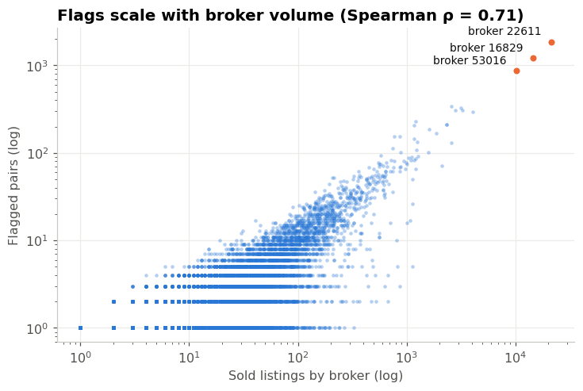
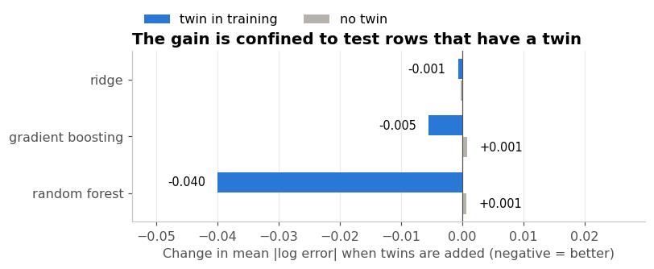
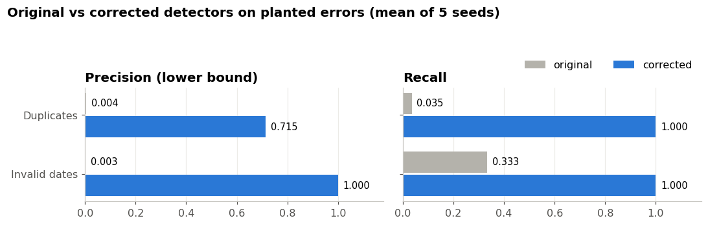
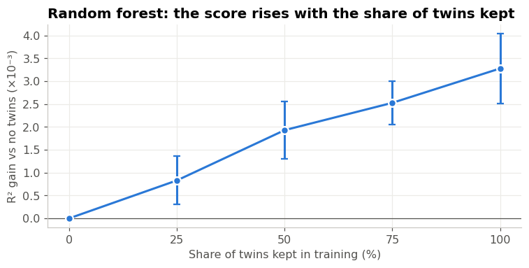

# USA Real Estate Data Quality Audit

[](https://github.com/Mariam-Fathi/real-estate-audit/actions/workflows/ci.yml)

An audit of the [USA Real Estate Dataset](https://www.kaggle.com/datasets/ahmedshahriarsakib/usa-real-estate-dataset)
(2,226,382 realtor.com listings) that starts by **auditing my own earlier analysis**. That analysis reported that
38.19% of listings were "suspicious" and raised the possibility of fraud. This project traces where those flags came
from, validates replacement detectors against planted errors, and measures what the real duplicates cost a price model.
It ships as a tested Python package with a data contract and a command-line audit.

## Key results

- **The 38% headline was an artefact.** Every "placeholder date" was an ordinary missing value (`astype(str)` turns
  `NaN` into `'nan'`), and 99.9% of the "suspicious" pairs were one home captured twice, once `for_sale` and once
  `sold`. "Suspicious" brokers were simply the biggest brokers.
- **The original duplicate detectors found under 4% of real duplicates** in a 5-seed experiment with planted errors,
  while flagging over 115,000 valid records. The corrected detectors found all planted date errors and duplicates.
- **For price errors, features mattered more than the model.** Isolation Forest's average precision went from 0.08 to
  0.59 with zip-relative price features, in the same range as a simpler robust z-score (0.45 with a MAD floor).
- **Duplicate leakage is real but small here.** Random forest R² rises 0.0033 with a random split. The whole effect
  falls on the 12% of test rows whose home is also in training, where error drops 14%.

<p align="center"> </p>

## The three parts

### [Part 1: Root-cause analysis](notebooks/01_root_cause_analysis.ipynb)

| Original claim | Finding |
|---|---|
| 734,297 "placeholder dates" | All are missing values. Missingness follows status: 0% for `sold`, 100% for `ready_to_build`. |
| 57,930 "same price, different dates" groups | 99.9% are a `for_sale` + `sold` pair of one home. The "time span" is the holding period (median 8.6 years). |
| 66,960 "price manipulation" cases | The same pairs found with a different key (99.8%). |
| A few brokers drive most flags | The top 3 are the 3 largest brokers, each flagged on ~8.5% of sales; flags track volume (Spearman ρ = 0.71). |
| (unreported) | `groupby` silently dropped 57,388 duplicated records with a missing key value. |

### [Part 2: Detector validation](notebooks/02_detector_validation.ipynb)

16,000 known errors were planted per seed into the real data, and each detector was scored over 5 seeds. Precision is
a range: the lower bound counts flags on errors already present in the real data as false positives.

| Error family | Detector | Precision | Recall |
|---|---|---|---|
| Invalid dates | original placeholder list | 0.003 | 0.33 |
| | corrected: strict parse, sentinels, plausible range | 1.00 | 1.00 |
| Duplicate listings | original "same price, different dates" | 0.004 | 0.035 |
| | corrected: same listing and status, tolerant of missing values | 0.72–1.00 | 1.00 |
| Price unit errors (×10 … ÷1000) | robust z of price/sq ft within zip code, MAD floor | 0.04–0.84 | 0.92 |
| | Isolation Forest (all features) | 0.01–0.16 | 0.97 |

The main limitation is stated in the notebook: I designed both the planted errors and the detectors, so the date
results in particular are close to guaranteed by construction.

<p align="center"></p>

### [Part 3: Duplicate leakage in price models](notebooks/03_duplicate_leakage.ipynb)

A paired design: the test set is held fixed, and training sets of identical size keep 0–100% of the "twins" (training
records of a home that is also in the test set).

| Model | R² without twins | Inflation from twins | On test rows with a twin |
|---|---:|---:|---:|
| Ridge | 0.561 | +0.0000 | R² +0.001 |
| Gradient boosting | 0.724 | +0.0015 ± 0.0026 (not significant) | R² +0.007 |
| Random forest | 0.792 | **+0.0033 ± 0.0008** | R² **+0.041**, error −14% |

Twins usually share the price (80%) but almost never the features (4%), so models can't look the answer up. Whether
twins count as leakage at all depends on the use case: valuing new homes, or re-pricing homes already in the database.

<p align="center"></p>

## The `reaudit` package

```bash
pip install -e ".[dev]"
reaudit audit data/raw/realtor-data.zip.csv --out reports/
```

```
2,226,382 records, 91,582 flagged (32s) -> reports/realtor-data_report.md
  invalid_date              2
  listing_duplicate     4,815
  zero_price              280
  price_outlier        86,729
```

The command:
1. **Enforces a data contract** ([pandera](https://pandera.readthedocs.io)). A file with the wrong columns, types or
   status values is rejected with a list of violations.
2. **Counts expectation violations**, e.g. 280 zero prices and 120 implausible bedroom counts.
3. **Runs the validated detectors.**
4. **Writes three outputs:** a CSV of flagged records, a Markdown report and a JSON summary.

| Module | Contents |
|---|---|
| `contract.py` | structure schema (fatal) and quality expectations (reported) |
| `detectors.py` | corrected detectors: invalid dates, listing duplicates, robust price z-score, Isolation Forest baseline |
| `legacy.py` | the original series' detectors, vectorised, kept for comparison |
| `corrupt.py` / `evaluate.py` | error injection with ground-truth labels; precision/recall/AP metrics |
| `leakage.py` | property ids, twin-controlled splits, models and metrics for Part 3 |
| `audit.py` / `cli.py` | the `reaudit audit` command |

## Repository layout

```
src/reaudit/      package (see above)
tests/            unit tests (pytest), run in CI on Python 3.10, 3.12 and 3.13
experiments/      the Part 2 and Part 3 experiments; results land in results/
notebooks/        build_0N.py generates each notebook; 0N_*.ipynb is the executed result
results/          experiment outputs read by the notebooks
docs/figures/     charts used in this README (scripts/export_figures.py)
```

## Reproduce

```bash
pip install -e ".[dev,notebooks]"
python -c "import kagglehub, shutil; p = kagglehub.dataset_download('ahmedshahriarsakib/usa-real-estate-dataset'); shutil.copytree(p, 'data/raw', dirs_exist_ok=True)"
pytest                                        # unit tests; no data needed
python experiments/run_validation.py 5        # Part 2, ~10 min
python experiments/run_leakage.py 5           # Part 3, ~25 min
python experiments/run_naive_split.py 5       # Part 3 cross-check, ~10 min
for n in 01 02 03; do python notebooks/build_$n.py; done
for f in notebooks/0*.ipynb; do python -m nbconvert --to notebook --execute --inplace "$f"; done
python scripts/export_figures.py
```

Each notebook asserts the numbers it reports, so a run that completes reproduces the results above. The notebooks also
run on Kaggle: with Internet turned on, the first cell clones this repository and reads the dataset from the Kaggle input.

## Data

USA Real Estate Dataset by Ahmed Shahriar Sakib, scraped from realtor.com and published on
[Kaggle](https://www.kaggle.com/datasets/ahmedshahriarsakib/usa-real-estate-dataset) (version 25, 2,226,382 rows).
`brokered_by` and `street` are categorically encoded by the dataset author for privacy. The data is not redistributed here.
